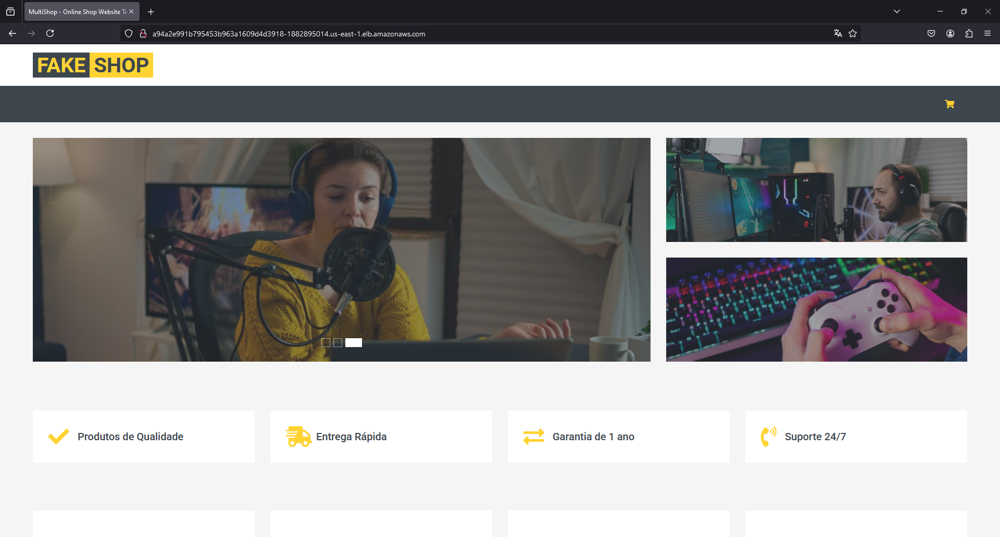
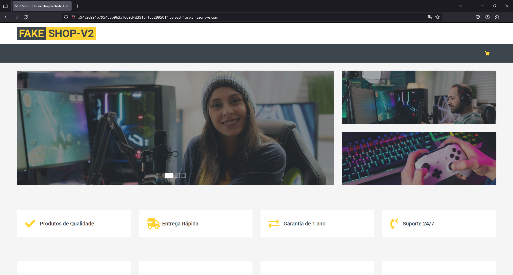

# Fake Shop

## Variável de Ambiente
DB_HOST	=> Host do banco de dados PostgreSQL.

DB_USER => Nome do usuário do banco de dados PostgreSQL.

DB_PASSWORD	=> Senha do usuário do banco de dados PostgreSQL.

DB_NAME	=>	Nome do banco de dados PostgreSQL.

DB_PORT	=>	Porta de conexão com o banco de dados PostgreSQL.

## Imagem salva no Docker Hub
https://hub.docker.com/repository/docker/silvajrdev/fake-shop/general

## Aplicação versão V1

## Aplicação versão V2
